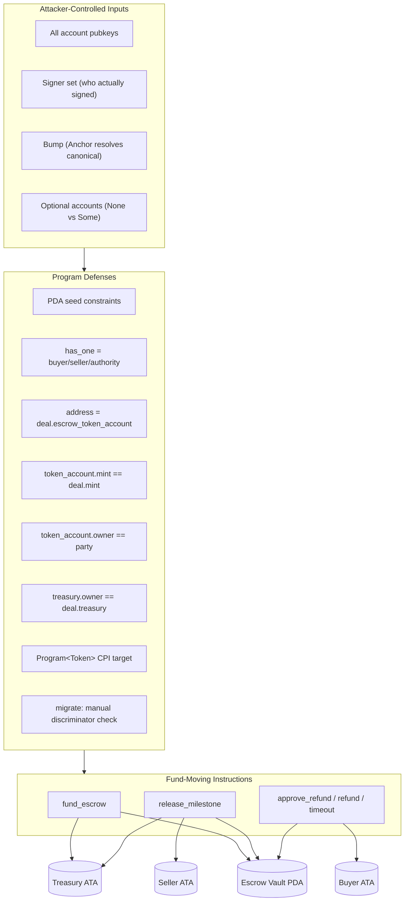

# Sealed Escrow — Solana Sea-Level Attack Audit & Test Plan

**Scope:** `programs/escrow/src/instructions/*.rs`, `state.rs`  
**Program ID:** `3WSjgWUKWhsENKJ1ibnbgvaiuQ8THJp4Mp7uGTUyeYeJ`  
**Date:** 2026-08-03  
**Mode:** Read-only audit + test plan (no file changes)

---

## Executive Summary

The Sealed escrow program applies Anchor account constraints consistently on all fund-moving paths. Critical bindings are in place:

- **Vault binding** via `address = deal.escrow_token_account` on every transfer path
- **Mint/owner checks** on buyer/seller ATAs
- **Treasury validation** at CPI time (`owner == deal.treasury && mint == deal.mint`)
- **PDA seeds** on deal, vault, config, and tier accounts
- **`Program<'info, Token>`** blocks fake token-program CPI redirection
- **Stale refund approval clearing** on `fund_escrow` and `release_milestone`

**No CRITICAL exploitable fund-theft vectors** were found in the current instruction set, assuming deals are created through the normal `create_deal` flow (vault PDA init in the same transaction).

**Highest-risk findings** are business-logic / policy gaps, not direct vault drains:

| Severity | Finding | Impact |
|----------|---------|--------|
| **HIGH** | Optional `config` on `create_deal` → permanent fee-free deals | Platform fee bypass when config exists on-chain |
| **MEDIUM** | `buyer == seller` not forbidden | Self-deals, future reputation/abuse surface |
| **MEDIUM** | Vault mint/authority not re-validated post-creation | Defense-in-depth gap (PDA signing fails if corrupted) |
| **MEDIUM** | `approve_refund` cross-tx TOCTOU | Mitigated by fund/release flag clears; ordering still matters |
| **LOW** | `creator_wallet` buyer-asserted (not signer-proven) | Safe for fees today; risky if `creator` gains non-fee meaning |
| **LOW** | Wrong error codes (`UnauthorizedBuyer` for non-party seller) | UX/debugging only |

**Pre-mainnet priority:** Implement vault/treasury/mint substitution tests, authority-gating tests, and the migration discriminator test. Run alongside existing `TIERING_DEVNET_TEST.md` blocking migration test.

---

## Sea-Level Threat Model

In Solana's sea-level model, the attacker controls **every account** passed to an instruction. Defenses must not trust client-supplied pubkeys without constraints tying them to signers, PDAs, or on-chain state.



---

## Per-Instruction Analysis

### Config (`init_config`, `set_fee`, `set_treasury`, `set_authority`, `set_tiers`)

| Vector | Verdict | Notes |
|--------|---------|-------|
| Account substitution | ✅ Safe | Config PDA seeds `[b"config"]`, `bump = config.bump` |
| Signer spoofing | ✅ Safe | `has_one = authority @ UnauthorizedAuthority` (```47:52:programs/escrow/src/instructions/config.rs```) |
| PDA bump | ✅ Safe | Stored bump validated on every update |
| Privilege escalation | ✅ Safe | All mutators require config authority signer |
| Fee griefing | ✅ Safe | `fee_bps <= MAX_FEE_BPS (500)`, tier rates capped (```90:97:programs/escrow/src/instructions/config.rs```) |
| Duplicate tier IDs | ✅ Safe | Rejected at ```103:107:programs/escrow/src/instructions/config.rs``` |

**Finding F-01 (LOW):** First `init_config` caller becomes authority — deployment race.  
**Exploit:** Front-run program deployment init.  
**Mitigation:** Init in same deploy tx; verify authority post-deploy.

---

### Tier (`set_user_tier`, `clear_user_tier`)

| Vector | Verdict | Notes |
|--------|---------|-------|
| Non-authority assignment | ✅ Safe | `has_one = authority` (```27:31:programs/escrow/src/instructions/tier.rs```) |
| Tier PDA substitution | ✅ Safe | Seeds `[b"tier", wallet]` bind wallet |
| Unknown tier ID | ✅ Safe | `UnknownTierId` (```53:56:programs/escrow/src/instructions/tier.rs```) |
| `init_if_needed` reentrancy | ✅ Safe | No self-CPI; single-threaded account locks |

**Finding F-02 (LOW):** `set_user_tier` does not require `user_tier.wallet == wallet` post-init constraint — handler writes it (```58:61:programs/escrow/src/instructions/tier.rs```). Anchor seeds prevent wrong PDA.

---

### `create_deal`

| Vector | Verdict | Notes |
|--------|---------|-------|
| Fake vault | ✅ Safe | Vault `init` with seeds `[b"escrow-vault", deal_id]`, `token::authority = deal` (```28:35:programs/escrow/src/instructions/create_deal.rs```) |
| Fake deal PDA | ✅ Safe | Deal `init` with seeds `[b"deal", deal_id]` |
| Wrong mint | ✅ Safe | Stored in deal; enforced at fund/release via ATA constraints |
| Tier PDA cosplay | ✅ Safe | Seeds bind to `creator_wallet`; filter `t.wallet == creator_wallet` (```140:145:programs/escrow/src/instructions/create_deal.rs```) |
| Invalid creator | ✅ Safe | Must be buyer or seller (```82:85:programs/escrow/src/instructions/create_deal.rs```) |
| Milestone griefing | ✅ Safe | Max 10 milestones, deal_id max 32 chars (```67:68:programs/escrow/src/instructions/create_deal.rs```) |
| Fake token_program | ✅ Safe | `Program<'info, Token>` (```55:55:programs/escrow/src/instructions/create_deal.rs```) |

**Finding F-03 (HIGH): Fee bypass via optional config**

```38:42:programs/escrow/src/instructions/create_deal.rs
    /// Global platform config, if it exists — the deal snapshots its fee_bps +
    /// treasury. Optional so deals can still be created before init_config
    /// (they're then fee-free). Seeds-validated when provided.
    #[account(seeds = [b"config"], bump = config.bump)]
    pub config: Option<Account<'info, Config>>,
```

When `config` is omitted (`None`), handler sets `fee_bps = 0`, `treasury = default` (```179:185:programs/escrow/src/instructions/create_deal.rs```) — **permanently fee-free**, even if config exists on-chain.

- **Expected (current):** Intentional for pre-config / fee-free bootstrap
- **Desired (if mandatory fees):** Make `config` required after `init_config`, or reject deals when config exists but is omitted
- **Exploit:** Buyer builds tx omitting config account → snapshots zero fees forever
- **Severity:** HIGH (platform revenue), not fund theft

**Finding F-04 (MEDIUM): buyer == seller self-deal allowed**

No `require!(buyer != seller)`. Buyer can set `seller = buyer.key()`.

- **Exploit:** Self-deal for fee laundering, milestone theater, or future reputation gaming
- **File:** ```10:14:programs/escrow/src/instructions/create_deal.rs``` (missing constraint)

**Finding F-05 (LOW): creator_wallet trust boundary**

Documented at ```74:81:programs/escrow/src/instructions/create_deal.rs``` — buyer asserts creator, safe for fee-side selection only. If `creator` later drives reputation, this becomes privilege escalation.

---

### `fund_escrow`

| Vector | Verdict | Notes |
|--------|---------|-------|
| Wrong vault | ✅ Blocked | `address = deal.escrow_token_account` (```19:23:programs/escrow/src/instructions/fund_escrow.rs```) |
| Wrong buyer ATA | ✅ Blocked | `owner == buyer`, `mint == deal.mint` (```25:29:programs/escrow/src/instructions/fund_escrow.rs```) |
| Fake treasury | ✅ Blocked | Handler: `owner == deal.treasury && mint == deal.mint` (```70:73:programs/escrow/src/instructions/fund_escrow.rs```) |
| Non-buyer signer | ✅ Blocked | `has_one = buyer` (```12:14:programs/escrow/src/instructions/fund_escrow.rs```) |
| Stale refund race | ✅ Mitigated | Clears `buyer_refund_ok` / `seller_refund_ok` (```96:97:programs/escrow/src/instructions/fund_escrow.rs```) |
| Over-funding | ✅ Blocked | `OverFunding` (```43:46:programs/escrow/src/instructions/fund_escrow.rs```) |

**Finding F-06 (MEDIUM): Vault mint/authority not re-validated**

Only pubkey address is checked — not `escrow_token_account.mint == deal.mint` or `escrow_token_account.owner == deal.key()`.

- **Exploit path:** Requires corrupt `deal.escrow_token_account` field — only writable in `create_deal` where vault is correctly inited
- **Actual impact:** PDA signing fails at CPI if authority mismatch → no drain
- **Recommendation:** Add defense-in-depth constraints

**Finding F-07 (LOW): `has_fee()` 0-side buyer path**

When `buyer_fee == 0` but `seller_fee_bps > 0`, `buyer_fee_paid = true` without treasury at fund (```61:86:programs/escrow/src/instructions/fund_escrow.rs```). Correct by design (Test 4 in TIERING_DEVNET_TEST.md).

---

### `release_milestone`

| Vector | Verdict | Notes |
|--------|---------|-------|
| Wrong seller ATA | ✅ Blocked | `owner == deal.seller`, `mint == deal.mint` (```25:29:programs/escrow/src/instructions/release_milestone.rs```) |
| Wrong vault | ✅ Blocked | `address = deal.escrow_token_account` |
| Non-buyer release | ✅ Blocked | `has_one = buyer` |
| Release unfunded milestone | ✅ Blocked | Status must be `Funded` or `InProgress` — partial fund stays `Created` |
| Treasury redirection | ✅ Blocked | Handler validation (```82:85:programs/escrow/src/instructions/release_milestone.rs```) |
| Stale refund race | ✅ Mitigated | Clears both refund flags (```109:110:programs/escrow/src/instructions/release_milestone.rs```) |
| PDA signing | ✅ Safe | Seeds `[b"deal", deal_id, bump]` with stored `deal.bump` |

**Accounting invariant verified:** `released_amount += amount` (full milestone gross); vault outflow = `seller_net + seller_fee = amount`. Refund math `funded - released` matches remaining vault balance.

---

### `approve_refund` (two-step mutual refund)

| Vector | Verdict | Notes |
|--------|---------|-------|
| Non-party approval | ✅ Blocked | Handler else-branch (```61:63:programs/escrow/src/instructions/approve_refund.rs```) |
| Refund redirection | ✅ Blocked | `buyer_token_account.owner == deal.buyer` (```42:46:programs/escrow/src/instructions/approve_refund.rs```) |
| Wrong vault | ✅ Blocked | `address = deal.escrow_token_account` |
| Signer spoofing | ✅ Safe | `Signer` required; party check in handler |
| Cross-tx TOCTOU | ⚠️ Partial | Fund/release clear flags; block-level ordering still possible |

**Finding F-08 (MEDIUM): Cross-tx approval race**

- **Scenario:** Buyer approves → seller submits approve in same block as `release_milestone`  
- **Mitigation:** Release clears flags before seller tx executes → refund doesn't fire on stale state  
- **Residual:** Block producer ordering can surprise users (not fund theft)

**Finding F-09 (LOW): Wrong error for non-party / unauthorized seller**

Returns `UnauthorizedBuyer` for any non-buyer signer including seller-unauthorized cases (```62:62:programs/escrow/src/instructions/approve_refund.rs```).

---

### `refund` (legacy dual-signer)

| Vector | Verdict | Notes |
|--------|---------|-------|
| Signer spoofing | ✅ Safe | Both `buyer` and `seller` must be `Signer` (```9:13:programs/escrow/src/instructions/refund.rs```) |
| has_one binding | ✅ Safe | ```17:18:programs/escrow/src/instructions/refund.rs``` |

Superseded by `approve_refund`; kept for compatibility. No additional sea-level risk beyond requiring both signers in one tx.

---

### `cancel_deal`

| Vector | Verdict | Notes |
|--------|---------|-------|
| Non-buyer cancel | ✅ Blocked | `has_one = buyer` |
| Cancel funded deal | ✅ Blocked | Status must be `Created` only (```15:15:programs/escrow/src/instructions/cancel_deal.rs```) |
| Partial fund reclaim | ✅ Safe | Refunds `funded - released` before close (```38:59:programs/escrow/src/instructions/cancel_deal.rs```) |
| Close/reopen | ✅ Safe | Deal + vault closed; same `deal_id` can be re-created only after full close |

---

### `close_deal`

| Vector | Verdict | Notes |
|--------|---------|-------|
| Premature close | ✅ Blocked | Status `Completed` or `Refunded` only |
| Non-buyer | ✅ Blocked | `has_one = buyer` |
| Non-zero vault | ✅ Safe | SPL `close_account` requires zero balance |

---

### `buyer_timeout_refund`

| Vector | Verdict | Notes |
|--------|---------|-------|
| Early timeout | ✅ Blocked | `TimeoutNotReached` — 30 days from `funded_at` (```43:46:programs/escrow/src/instructions/buyer_timeout_refund.rs```) |
| Non-buyer | ✅ Blocked | `has_one = buyer` |
| Race with approve_refund | ✅ First-wins | Deal closed on timeout; other paths fail on closed account |

---

### `migrate_deal` / `migrate_config`

| Vector | Verdict | Notes |
|--------|---------|-------|
| Wrong account type | ✅ Blocked | Manual discriminator check (```61:64:programs/escrow/src/instructions/migrate_deal.rs```) |
| Wrong PDA | ✅ Blocked | Seed constraints |
| Shrink / mutate terms | ✅ Safe | Grow-only, zero-fill tail |
| Fund theft | ✅ Safe | No token CPI |
| Griefing | ✅ Benign | Permissionless grow is beneficial |

**Finding F-10 (LOW): Wrong error code on wrong owner**

Uses `InvalidCreator` for non-program-owned account (```57:57:programs/escrow/src/instructions/migrate_deal.rs```) — misleading, not exploitable.

---

## Findings Table

| ID | Severity | Instruction | File:Line | Vector | Exploit Steps | Status |
|----|----------|-------------|-----------|--------|---------------|--------|
| F-03 | **HIGH** | `create_deal` | `create_deal.rs:38-42,179-185` | Optional config omission | 1. Platform has config with fees 2. Buyer calls `create_deal` omitting `config` 3. Deal permanently fee-free | Open (by design) |
| F-04 | **MEDIUM** | `create_deal` | `create_deal.rs:10-14` | buyer == seller | 1. Buyer sets seller = own pubkey 2. Self-deal proceeds | Open |
| F-06 | **MEDIUM** | `fund_escrow`, `release_milestone`, refunds | `fund_escrow.rs:19-23` | Vault mint/authority not re-checked | Theoretically pass non-vault at stored address; fails at PDA CPI | Defense gap |
| F-08 | **MEDIUM** | `approve_refund` | `approve_refund.rs:52-73` | Cross-tx TOCTOU | Approve + fund/release in same block; ordering affects outcome | Mitigated |
| F-05 | **LOW** | `create_deal` | `create_deal.rs:74-81` | creator_wallet unproven | Buyer names seller as creator for tier pricing | Safe for fees |
| F-01 | **LOW** | `init_config` | `config.rs:12-27` | Init race | Front-run first config init | Deploy-time |
| F-09 | **LOW** | `approve_refund` | `approve_refund.rs:62` | Wrong error code | Non-party gets `UnauthorizedBuyer` not distinct code | UX |
| F-10 | **LOW** | `migrate_deal` | `migrate_deal.rs:57` | Wrong error code | Non-Deal owner → `InvalidCreator` | UX |

**Controls verified (no finding):** vault substitution, fake token_program, wrong seller/buyer ATA owner, treasury owner mismatch, tier PDA seed mismatch, non-authority tier/config mutation, non-canonical PDA bumps (Anchor-enforced), CPI reentrancy (no self-CPI).

---

## Part 2: Test Suite Design

### Existing Coverage

- `tests/platform-fee.ts` — fee behavior skeleton; authority gate stub; treasury rejection noted but not implemented
- `TIERING_DEVNET_TEST.md` — migration blocking test, tier abuse cases, has_fee 0-side trap

**Gap:** No negative sea-level substitution tests in repo.

---

### Custom Error Code Reference

| Error | Code |
|-------|------|
| `UnauthorizedBuyer` | 6007 |
| `UnauthorizedSeller` | 6008 |
| `UnauthorizedAuthority` | 6011 |
| `InvalidCreator` | 6016 |
| `AccountDidNotDeserialize` | 6017 |
| `TreasuryAccountRequired` | 6018 |
| Anchor `ConstraintAddress` | 2012 |
| Anchor `ConstraintSeeds` | 2006 |
| Anchor invalid program | 3008 |

---

### Full Test File Outline: `tests/sea-level-attacks.ts`

```typescript
describe("sea-level attacks — must fail closed", () => {
  // Shared setup: provider, program, mint, buyer, seller, stranger,
  // configPda, treasuryOwner, treasuryAta, helpers (findDeal, findVault, createDeal)

  describe("vault & token program substitution", () => { ... });
  describe("party authorization", () => { ... });
  describe("fee & treasury invariants", () => { ... });
  describe("mint & ATA cosplay", () => { ... });
  describe("migration & discriminator", () => { ... });
  describe("config & tier privilege", () => { ... });
  describe("policy edge cases", () => { ... });
});
```

---

### Concrete Tests (must FAIL on-chain)

#### 1. `wrong_vault_ata_for_deal`

**Setup:** Normal deal created; vault funded.

**Malicious accounts:** Pass a different token account (attacker-owned ATA) as `escrowTokenAccount` while keeping correct `deal`.

```typescript
it("wrong_vault_ata_for_deal", async () => {
  const dealId = "vault-sub";
  const dealPda = findDeal(dealId);
  const realVault = findVault(dealId);
  const fakeVault = await getOrCreateAssociatedTokenAccount(
    connection, payer, mint, stranger.publicKey
  );

  await expect(
    program.methods.fundEscrow(new BN(1000)).accounts({
      buyer: buyer.publicKey,
      deal: dealPda,
      escrowTokenAccount: fakeVault.address, // NOT deal.escrow_token_account
      buyerTokenAccount: buyerAta,
      treasuryTokenAccount: null,
      tokenProgram: TOKEN_PROGRAM_ID,
    }).signers([buyer]).rpc()
  ).to.be.rejectedWith(/ConstraintAddress|2002|2003/);
});
```

**Expected:** Anchor `ConstraintAddress` (address != `deal.escrow_token_account`).

---

#### 2. `wrong_token_program_pubkey`

**Setup:** Funded deal ready for release.

**Malicious accounts:** Pass System Program (or random keypair) as `tokenProgram`.

```typescript
it("wrong_token_program_pubkey", async () => {
  await expect(
    program.methods.releaseMilestone(0).accounts({
      buyer: buyer.publicKey,
      deal: dealPda,
      escrowTokenAccount: vaultPda,
      sellerTokenAccount: sellerAta,
      treasuryTokenAccount: treasuryAta,
      tokenProgram: SystemProgram.programId, // NOT Tokenkeg...
    }).signers([buyer]).rpc()
  ).to.be.rejectedWith(/InvalidProgramId|3008|ConstraintOwner/);
});
```

**Expected:** Anchor program ID constraint failure.

---

#### 3. `non_party_calls_approve_refund`

**Setup:** Funded deal with both refund flags false.

**Malicious accounts:** Stranger signs as `signer`.

```typescript
it("non_party_calls_approve_refund", async () => {
  await expect(
    program.methods.approveRefund().accounts({
      signer: stranger.publicKey,
      deal: dealPda,
      escrowTokenAccount: vaultPda,
      buyerTokenAccount: buyerAta,
      tokenProgram: TOKEN_PROGRAM_ID,
    }).signers([stranger]).rpc()
  ).to.be.rejected; // EscrowError::UnauthorizedBuyer (6007)
});
```

**Expected:** `UnauthorizedBuyer` (6007) — note: also used for unauthorized seller edge cases.

---

#### 4. `create_deal_without_config_fee_bypass`

**Setup:** `init_config` + `set_treasury` active; fees should apply.

**Malicious accounts:** Omit `config` and `creatorTier` (pass `null`).

```typescript
it("create_deal_without_config_fee_bypass — documents current behavior", async () => {
  const dealId = "fee-bypass";
  await program.methods.createDeal(dealId, milestones, total, buyer.publicKey)
    .accounts({
      buyer: buyer.publicKey,
      seller: seller.publicKey,
      deal: findDeal(dealId),
      mint,
      escrowTokenAccount: findVault(dealId),
      config: null,           // deliberately omitted
      creatorTier: null,
      tokenProgram: TOKEN_PROGRAM_ID,
      systemProgram: SystemProgram.programId,
      rent: SYSVAR_RENT_PUBKEY,
    }).signers([buyer]).rpc();

  const deal = await program.account.deal.fetch(findDeal(dealId));
  assert.equal(deal.feeBps, 0);
  assert.ok(deal.treasury.equals(PublicKey.default));
  // EXPECTED (current): succeeds, permanently fee-free
  // DESIRED (if mandatory fees): should fail with new FeeConfigRequired error
});
```

**Expected (current):** SUCCESS — fee bypass (F-03).  
**Desired (optional hardening):** New error e.g. `ConfigRequired`.

---

#### 5. `buyer_equals_seller_self_deal`

**Setup:** None.

```typescript
it("buyer_equals_seller_self_deal — documents current behavior", async () => {
  const dealId = "self-deal";
  await program.methods.createDeal(dealId, milestones, total, buyer.publicKey)
    .accounts({
      buyer: buyer.publicKey,
      seller: buyer.publicKey, // same wallet
      // ... rest
    }).signers([buyer]).rpc();

  const deal = await program.account.deal.fetch(findDeal(dealId));
  assert.ok(deal.buyer.equals(deal.seller));
  // EXPECTED (current): succeeds
  // DESIRED: SelfDealNotAllowed (new error)
});
```

**Expected (current):** SUCCESS.  
**Desired:** Reject with new constraint.

---

#### 6. `wrong_mint_on_buyer_token_account`

**Setup:** Deal with USDC mint A; attacker passes ATA for mint B.

```typescript
it("wrong_mint_on_buyer_token_account", async () => {
  const wrongMint = await createMint(connection, payer, authority, null, 6);
  const wrongBuyerAta = await getOrCreateAssociatedTokenAccount(
    connection, payer, wrongMint, buyer.publicKey
  );

  await expect(
    program.methods.fundEscrow(new BN(1000)).accounts({
      buyer: buyer.publicKey,
      deal: dealPda,
      escrowTokenAccount: vaultPda,
      buyerTokenAccount: wrongBuyerAta.address, // mint B != deal.mint
      treasuryTokenAccount: null,
      tokenProgram: TOKEN_PROGRAM_ID,
    }).signers([buyer]).rpc()
  ).to.be.rejected; // ConstraintRaw or custom mint mismatch
});
```

**Expected:** Anchor constraint failure on `buyer_token_account.mint == deal.mint` (```28:28:programs/escrow/src/instructions/fund_escrow.rs```).

---

#### 7. `treasury_ata_wrong_owner_when_fees_active`

**Setup:** Fee-bearing deal (`fee_bps > 0`, treasury set). Fund with buyer fee > 0.

**Malicious accounts:** Treasury ATA owned by stranger, correct mint.

```typescript
it("treasury_ata_wrong_owner_when_fees_active", async () => {
  const wrongTreasuryAta = await getOrCreateAssociatedTokenAccount(
    connection, payer, mint, stranger.publicKey
  );

  await expect(
    program.methods.fundEscrow(totalAmount).accounts({
      buyer: buyer.publicKey,
      deal: feeDealPda,
      escrowTokenAccount: feeVaultPda,
      buyerTokenAccount: buyerAta,
      treasuryTokenAccount: wrongTreasuryAta.address,
      tokenProgram: TOKEN_PROGRAM_ID,
    }).signers([buyer]).rpc()
  ).to.be.rejected; // TreasuryAccountRequired (6018)
});
```

**Expected:** `TreasuryAccountRequired` (6018) from ```70:73:programs/escrow/src/instructions/fund_escrow.rs```.

---

#### 8. `release_milestone_seller_ata_not_owned_by_deal_seller`

**Setup:** Funded fee-bearing deal.

**Malicious accounts:** Pass buyer's or stranger's ATA as `sellerTokenAccount`.

```typescript
it("release_milestone_seller_ata_not_owned_by_deal_seller", async () => {
  await expect(
    program.methods.releaseMilestone(0).accounts({
      buyer: buyer.publicKey,
      deal: dealPda,
      escrowTokenAccount: vaultPda,
      sellerTokenAccount: buyerAta, // owner == buyer != deal.seller
      treasuryTokenAccount: treasuryAta,
      tokenProgram: TOKEN_PROGRAM_ID,
    }).signers([buyer]).rpc()
  ).to.be.rejected; // Constraint: seller_token_account.owner == deal.seller
});
```

**Expected:** Anchor constraint violation (```27:27:programs/escrow/src/instructions/release_milestone.rs```).

---

#### 9. `migrate_deal_wrong_account_discriminator`

**Setup:** Create a `UserTier` PDA or other program account.

**Malicious accounts:** Pass non-Deal account at deal PDA is impossible (seeds bind). Test with **wrong discriminator at deal PDA** by attempting migrate on config PDA:

```typescript
it("migrate_deal_wrong_account_discriminator", async () => {
  const configPda = findConfig();
  await expect(
    program.methods.migrateDeal("config-trick").accounts({
      payer: payer.publicKey,
      deal: configPda, // Config discriminator, not Deal
      systemProgram: SystemProgram.programId,
    }).signers([payer]).rpc()
  ).to.be.rejected; // AccountDidNotDeserialize (6017) OR ConstraintSeeds
});
```

**Expected:** `ConstraintSeeds` (wrong seeds for config pubkey) OR if seeds somehow match, `AccountDidNotDeserialize` (6017) from ```61:64:programs/escrow/src/instructions/migrate_deal.rs```.

Better variant — use deal PDA with corrupted discriminator (requires test harness account mutation) or pass a manually created account at wrong seeds.

---

#### 10. `set_user_tier_by_non_authority`

**Setup:** Config initialized with authority = deployer.

```typescript
it("set_user_tier_by_non_authority", async () => {
  const [userTierPda] = PublicKey.findProgramAddressSync(
    [Buffer.from("tier"), seller.publicKey.toBuffer()],
    program.programId
  );

  await expect(
    program.methods.setUserTier(seller.publicKey, 0).accounts({
      authority: stranger.publicKey,
      config: configPda,
      userTier: userTierPda,
      systemProgram: SystemProgram.programId,
    }).signers([stranger]).rpc()
  ).to.be.rejected; // UnauthorizedAuthority (6011)
});
```

**Expected:** `UnauthorizedAuthority` (6011) via `has_one = authority` (```30:30:programs/escrow/src/instructions/tier.rs```).

---

### Additional Recommended Tests

| Test | Expected Error | Priority |
|------|----------------|----------|
| `creator_tier_wrong_wallet_seed` | `ConstraintSeeds` | P1 |
| `fund_escrow_missing_treasury_on_fee_deal` | `TreasuryAccountRequired` | P1 |
| `approve_refund_stale_after_fund_escrow` | Second approve doesn't refund alone | P1 |
| `approve_refund_stale_after_release` | Flags cleared, no premature refund | P1 |
| `set_tiers_duplicate_id` | `DuplicateTierId` (6014) | P2 |
| `set_user_tier_unknown_tier_id` | `UnknownTierId` (6015) | P2 |
| `create_deal_invalid_creator_third_party` | `InvalidCreator` (6016) | P2 |
| `buyer_timeout_before_30_days` | `TimeoutNotReached` (6010) | P2 |
| `cancel_deal_after_partial_fund` | Success + refund (positive path) | P2 |

---

## Part 3: Implementation Priority (Pre-Mainnet)

### P0 — Blocking (run with TIERING_DEVNET_TEST.md Test 1)

1. Old-layout deal fails unmigrated after upgrade
2. `migrate_deal` unfreezes + fee behavior preserved

### P1 — Sea-level negative tests (implement first)

1. **wrong_vault_ata_for_deal** — core vault binding
2. **treasury_ata_wrong_owner_when_fees_active** — fee redirection
3. **wrong_mint_on_buyer_token_account** — mint cosplay
4. **release_milestone_seller_ata_not_owned_by_deal_seller** — payout redirection
5. **non_party_calls_approve_refund** — authorization
6. **set_user_tier_by_non_authority** — privilege escalation
7. **wrong_token_program_pubkey** — CPI redirection

### P2 — Policy / documentation tests

8. **create_deal_without_config_fee_bypass** — document expected vs desired; product decision
9. **buyer_equals_seller_self_deal** — document or add rejection
10. **migrate_deal_wrong_account_discriminator**

### P3 — Race / integration

11. approve_refund stale-flag tests after fund/release
12. SSS 0-side buyer fee + seller fee at release (TIERING Test 4)
13. Full platform-fee.ts implementation (currently stubs)

---

## Recommendations (No Code Changes Made)

1. **Fee bypass (F-03):** Product decision — if post-launch fees are mandatory, make `config: Account<Config>` required (non-optional) after `init_config`, or add a `require_config_snapshot` flag in config.
2. **Self-deals (F-04):** Add `require!(buyer.key() != seller.key(), ...)` unless intentionally allowed.
3. **Defense-in-depth:** Add to all vault-touching instructions:
   ```rust
   constraint = escrow_token_account.mint == deal.mint,
   constraint = escrow_token_account.owner == deal.key(),
   ```
4. **Error codes:** Use `UnauthorizedSeller` for non-party sellers in `approve_refund`; use dedicated error in `migrate_deal` for wrong owner.
5. **Client/SDK:** Always pass `config` in `create_deal` when config PDA exists; treat omission as bug in frontend, not feature.

---

## Summary

The escrow program's sea-level posture is **solid for fund safety**: vault, mint, party, and treasury bindings are enforced on all token CPI paths. The main audit findings are **policy gaps** (optional config fee bypass, self-deals) and **defense-in-depth** improvements, not direct vault drain exploits. The proposed `tests/sea-level-attacks.ts` suite targets the 10 attack scenarios you specified, with P1 tests recommended before mainnet alongside the existing migration blocking test in `TIERING_DEVNET_TEST.md`.

[REDACTED]